# dotnet_template_studio_for_wpf_example1

## 概要
Visual Studio の拡張機能である Template Studio を用いて、生成されたソースから、何のライブラリをどのように利用しているのかを学ぶ。  

Template Stuido  
https://github.com/microsoft/TemplateStudio  
Template Studio は、ウィザード ベースのエクスペリエンスを使用して、新しい WinUI 3、WPF、および UWP アプリの作成を加速する Visual Studio 2022 拡張機能のスイートです。(Google翻訳)

## 環境
Template Studio for WPF Version 5.2  
Microsoft Visual Studio Community 2022 (64 ビット) - Current
Version 17.4.1

## 利用手順
Template Studio for WPF をインストール
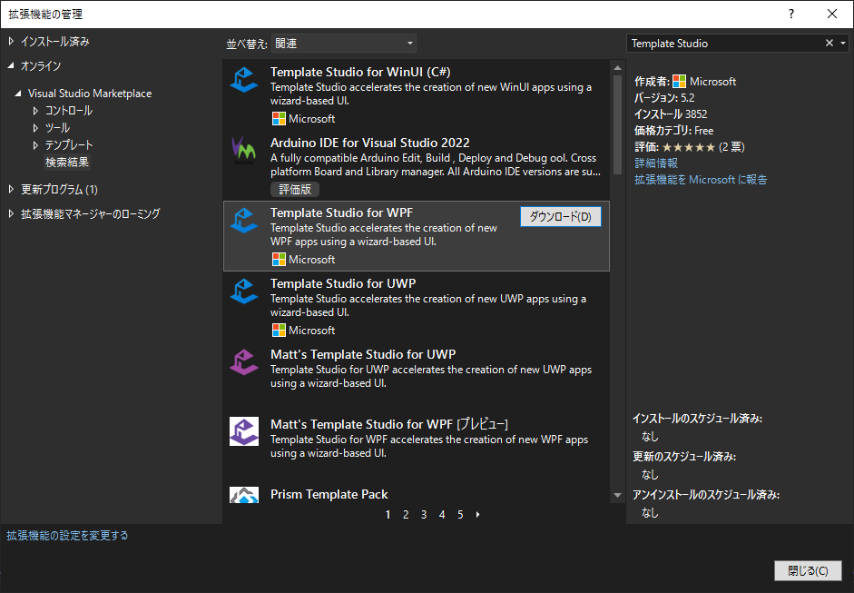

新しいプロジェクトの作成に Template Studio for WPF が追加される
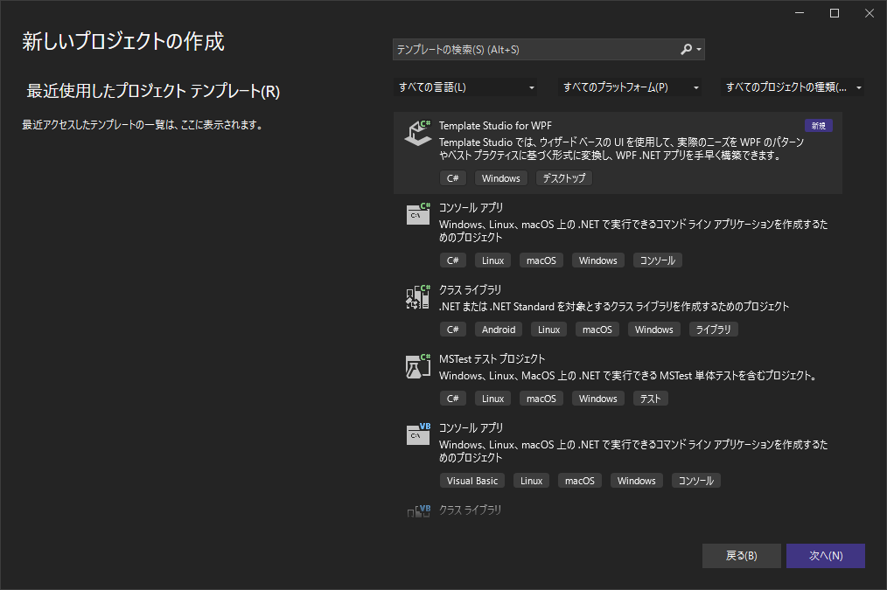

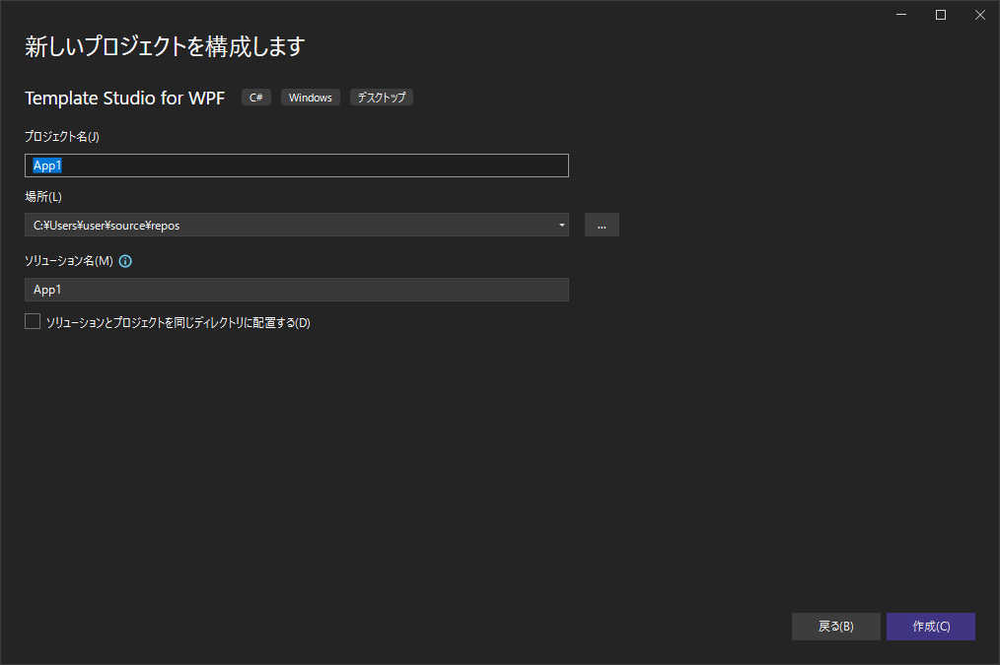

1.プロジェクトの種類
- Navigation Pane
- Blank
- MenuBar
- Ribbon

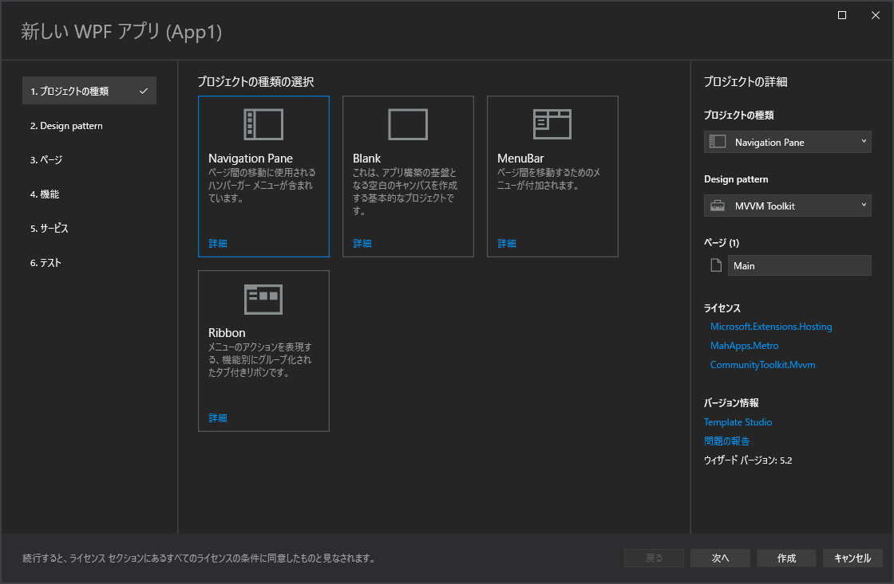

2.Design pattern
- MVVM Toolkit
- Code Behind
- Prism

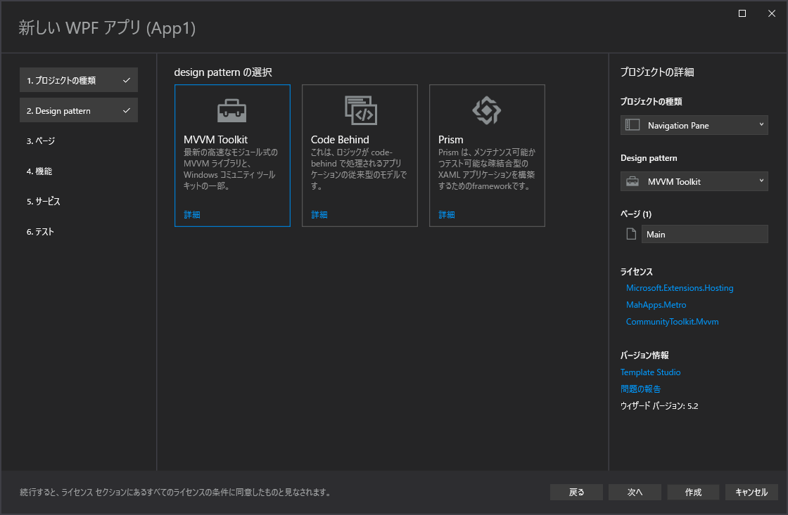

3.ページ
- Blank
- Settings
- WebView
- ListDetails
- Content Grid
- DataGrid

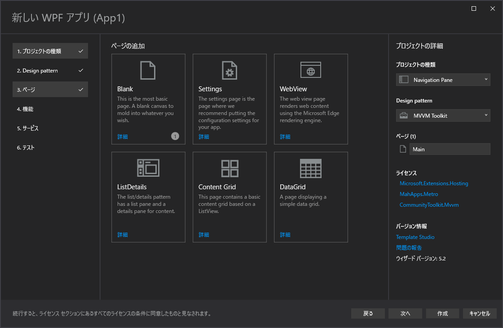

4.機能
- アプリケーションのライフサイクル
  - Persist And Restore
  - Multiple views
- パッケージ
  - MSIX Packaging
- ユーザーインタラクション
  - Toast Notifications
  - Theme Selection

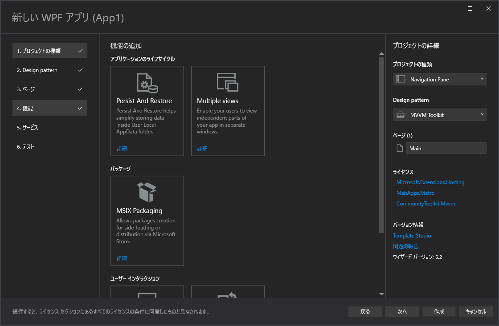
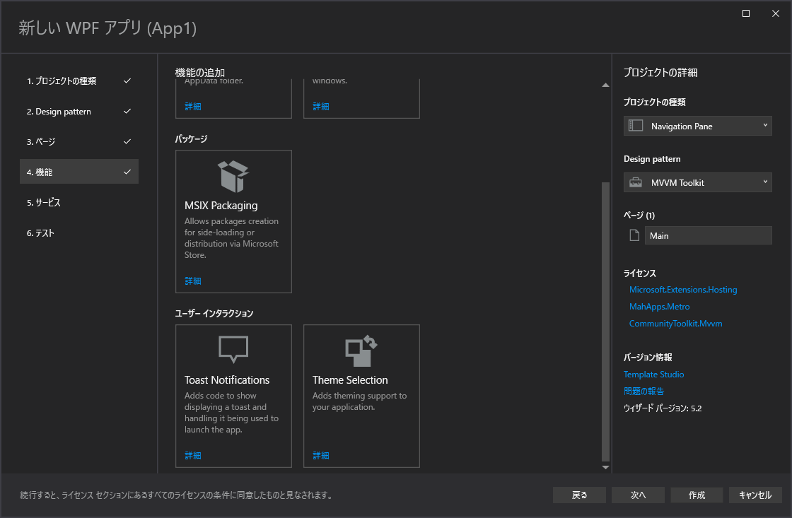

5.サービス
- Forced Login
- Optional Login

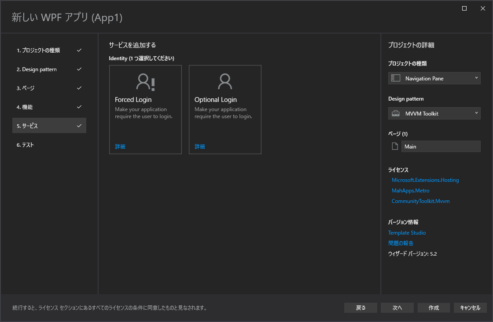

6.テスト
- Test App with MSTest
- Test App with NUnit
- Test App with xUnit
- Test Core library with MSTest
- Test Core library with NUnit
- Test Core library with xUnit
- Win App Driver

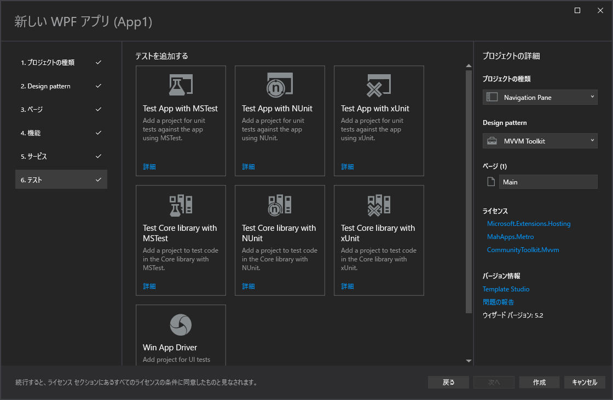
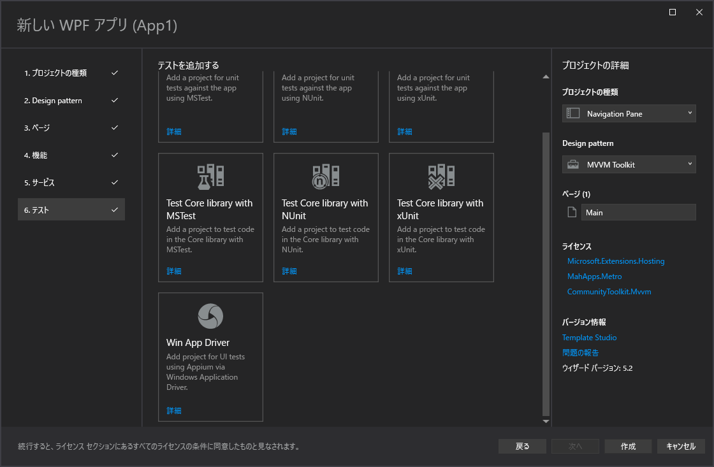

Markdown Editor v2  
https://marketplace.visualstudio.com/items?itemName=MadsKristensen.MarkdownEditor2
